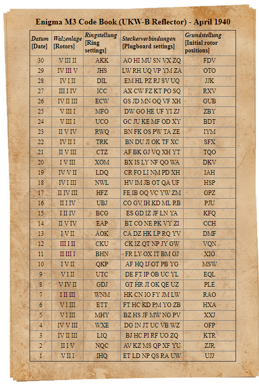

# Components of Enigma Machine

## PlugBoard

Through a series of 6 wired connections (plugs), 12 letters were linked such that when a letter was pressed if connected to another letter with the plugs, the letter was switched with the corresponding link. For example, if following connections were made using plugs `DY TZ QM IN JS PE`, then the transmitted will be ciphered as
```
The robot clicked disapprovingly, gurgled briefly inside its cubical interior and extruded a pony glass of brownish liquid. "Sir, you will undoubtedly end up in a drunkard's grave, dead of hepatic cirrhosis," it informed me virtuously as it returned my ID card. I glared as I pushed the glass across the table.
--------------------------------------------------
Zhp roboz clnckpy ynjaeerovnigld, gurglpy brnpfld nijnyp nzj cubncal nizprnor aiy pxzruypy a eoid glajj of browinjh lnmuny. "Jnr, dou wnll uiyoubzpyld piy ue ni a yruikary'j gravp, ypay of hpeaznc cnrrhojnj," nz niforqpy qp vnrzuoujld aj nz rpzuripy qd NY cary. N glarpy aj N eujhpy zhp glajj acrojj zhp zablp.
```
Each alphabet is replaced by the corresponding link, those letters with no links are forwarded as is.

### Implementation

Given the plug-board setup for the date in the form of `DY TZ QM IN JS PE`, the program will convert it to a dictionary, where the intended letters are switched. For any given input (key) to the dictionary, corresponding output (value) will be received when ciphered for the Plug-Board.

The above configuration of plug-board setup is represented in code as follows,
```python
{'a': 'a', 'b': 'b', 'c': 'c', 'd': 'y', 'e': 'p', 'f': 'f', 'g': 'g', 'h': 'h', 'i': 'n', 'j': 's',
 'k': 'k', 'l': 'l', 'm': 'q', 'n': 'i', 'o': 'o', 'p': 'e', 'q': 'm', 'r': 'r', 's': 'j', 't': 'z',
 'u': 'u', 'v': 'u', 'w': 'w', 'x': 'x', 'y': 'd', 'z': 't'}
```
For [private-messages](../README.md#private-messages) a set of 26 such combinations of plug-bard setups is available in the `plug_links` list in the [private_code_presets.py](../data/private_code_presets.py) file. These setups can be accessed by using any ONE of the english alphabet letter when creating a code for a private-message.

## Rotor Mechanism

This implementation consists of 3 rotor-wheels used in a sequence. The ROTOR_COUNT is defined in [rotor_presets.py](../data/rotor_presets.py). If changing the ROTOR_COUNT, read the [CAUTION](#comments) 

Said to be the most complex part of the EnigmaMachine, the rotors increase the possible combination count by magnitudes. The rotors individually had 3 parts, 2 which could be changed on command.
1. **Inner-wiring:**\
   All the 26 (letter) inputs to the rotor were connected to different output locations, creating a jumble of the letters received. In contrast with the PlugBoard and Reflector, these connections did not form a two-way link.\ However, signals could flow from both sides of the rotor (left-to-right and right-to-left), in this case if letter 'A' was converted to 'X' when going from right-to-left, then letter 'X' will be converted to 'A' when going from left-to-right.   
2. **Notch:**\
   The notch position, allowed for the next rotor in sequence to be rotated by one. In the running of the EnigmaMachine, the right-most rotor will be rotated by one after every character in the message. When the right-most rotor reaches the notch position, the middle rotor will rotate by one. Therefore, right-most rotor needs to complete a full-rotation for the middle to rotate once, and middle needs to complete its full-rotation for left-most rotor to rotate once.\
   In some usages of the EnigmaMachine, some of the rotors had 2 notches instead of 1, in these cases half-rotations of those rotors allowed next rotors in sequence to be incremented. Generally positioned diametrically opposite, this python implementation allows for these notches to be positioned anywhere on the rotor.
3. **Offset / Rotational-Value:**\
   Each rotation of the rotor caused the inner-wiring to correspond to different letters on either side of the rotor. This off-set was denoted by an alphabet [A-Z]. After a full-rotation of the rotor, the inner-wiring will correspond to the original sequence present at the start of the message.

The inner-wiring of the rotors are historically represented as a string of letters for each rotor. The known [ring-settings](https://en.wikipedia.org/wiki/Enigma_rotor_details#Ring_setting) and [notch-positions](https://en.wikipedia.org/wiki/Enigma_rotor_details#Turnover_notch_positions) originally used in the war can be found on wikipedia.

### Implementation

In python, the ring setting shown as a string of letters is coded as a list of integers ranging from [0-25] corresponding to the 26 letters [a-z]. 

```python
[22, 21, 12, 24, 20, 1, 4, 0, 2, 14, 23, 10, 18, 11, 19, 5, 25, 8, 7, 17, 3, 6, 13, 9, 15, 16]
[4, 15, 14, 22, 24, 18, 17, 1, 19, 12, 6, 2, 16, 11, 0, 8, 23, 7, 21, 5, 20, 9, 10, 3, 25, 13]
```

The notch positions and offsets for each rotor-wheel are explicitly defined each time a new rotor configuration is set.

8 such rotor-wheels are available in [rotor_presets.py](../data/rotor_presets.py), of which 3 will be selected resulting in a total of 8P3(336) permutations in the placements of wheels alone. Rotor-wheels - 5, 6, and 7 (0 base counting) - will have double notches when used in the EnigmaMachine.

The presets for each day are defined in [data](../data) directory. Presets include the offsets and notch positions for each rotor.

## Reflector

A reflector was a part of the machine, that switched the incoming letter signal with another through a set of links pre-defined inside the reflector. As opposed to the [PlugBoard](#plugboard), the linkages for the reflector could not be changed, and all 26 letters were linked together forming 13 pairs.

For example, `ab, cr, do, eg, fq, ht, ik, jl, ms, ny, pz, ux , vw` could be the connections already made inside the reflector. The python implementation for such a reflector will be in the form of a dictionary as follows

```python
{'a': 'b', 'b': 'a', 'c': 'r', 'd': 'o', 'e': 'g', 'f': 'q', 'g': 'e', 'h': 't', 'i': 'k', 'j': 'l',
 'k': 'i', 'l': 'j', 'm': 's', 'n': 'y', 'o': 'd', 'p': 'z', 'q': 'f', 'r': 'c', 's': 'm', 't': 'h',
 'u': 'x', 'v': 'w', 'w': 'v', 'x': 'u', 'y': 'n', 'z': 'p'}
```

It is said that there were 3 possible reflectors available for a machines, most code-books available show that the reflectors are kept constant for the entire month. For this implementation of the EnigmaMachine, the reflector is hard coded into the [RotorSet class](rotor_set.py).

However, additional reflector configurations and the generator code for said reflectors is available in the `rotor_set.py`, commented out at the bottom of the file. For future versions an additional functionality can be added to change out the reflectors.

## Component Presets

An example of the code-book handed out to the communicating parties is shown below, such code-books were changed every month to ensure secure communication.
|  |
|:--:|
| Image Credits - [101 Computing](https://www.101computing.net/enigma-daily-settings-generator/) |

This code book references an Enigma Machine with 5 available rotors and 6 plugs\
Understanding the code for Date 30 we get:
+ **Rotors (Rotor No., notch):**\
left (5, A), middle (3, K), right (2, K)
+ **PlugBoard settings:**\
[AO, HI, MU, SN, VX, ZQ]
+ **Initial Rotor Positions (offsets):**\
left (F), middle (D), right (V)

To learn how a similar code-book is implemented for this project, read the [data directory documentation](../data/README.md#2-date-presets)

## Comments
- ROTOR_COUNT:
  Changing this value will render invalid, all the previously defined presets. It will be needed that new presets be defined for the date-presets. Any messages previously ciphered on the presets defined for the past ROTOR_COUNT will not work for the new ROTOR_COUNT and the subsequent presets.\
  New presets will also be needed for private-code-presets and the private-code itself will require a new format, when trying to send a [private-message](../README.md#private-messages)
